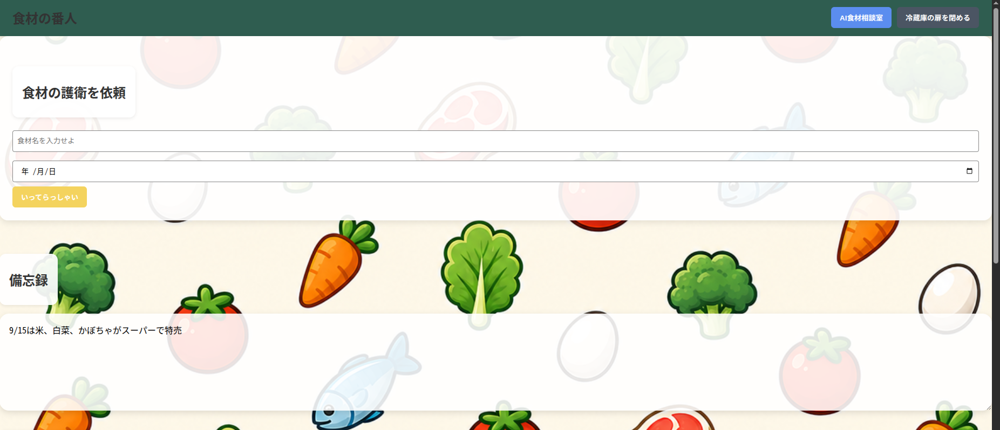
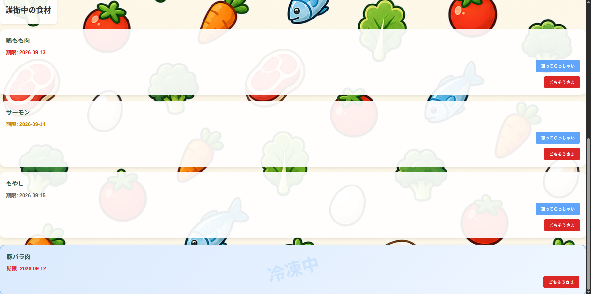
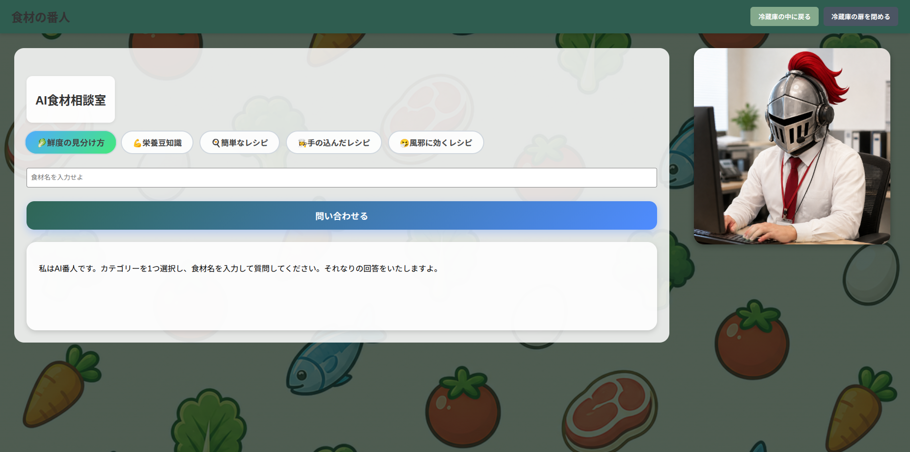

# food-guardian（食材の番人）

## これは何？
食材の賞味（消費）期限管理を支援するWebアプリケーションです。
冷蔵庫内の食材を登録し、期限順に一覧表示できます。
また、AIに対して食材に関する相談も可能です。

## 開発の背景・目的
冷蔵庫内の食材の期限をホワイトボードで管理していましたが、
外出先から確認できないことに不便を感じていました。
そこで、食材の期限を確認・管理できるWebアプリケーションを開発しました。
また、食材の活用方法をAIが提案する機能を取り入れることで、
AIを身近なものとして体験してもらうきっかけを作ることも目的としています。

## URL
https://food-guardian.net

## テスト用アカウント
* ID：testuser
* Password：p4wk

## 主な機能
* ユーザー登録
* ログイン・ログアウト
* 食材登録
* 食材削除
* 冷凍管理
* 賞味（消費）期限順表示
* メモ機能
* AI食材相談室

## 各画面の操作説明

### ログイン画面

* ユーザー名、パスワードが必須入力
* ユーザー登録が済んでいない場合は「冷蔵庫の主でない者はこちら」からユーザー登録をおこなう
* ログイン後は食材リストに遷移する

### ユーザー登録画面

* ユーザー名、パスワードを入力し、登録をおこなう
* すでに登録されているユーザー名は登録不可、パスワードはなんでもよい
  * ユーザー名、パスワードともに文字数、文字の種類等の制限なし
* ログイン画面に戻りたい場合は「冷蔵庫の扉を開く者はこちら」をクリック
* ユーザー登録後は自動的にログインがおこなわれ、食材リストに遷移する

### 食材リスト


* メインページ
* 食材登録フォーム、登録済みリスト、メモエリアの3つで構成
* 食材登録フォームでは食材名、期限を入力し、登録をおこなう
* 登録済みリストには登録した食材とその期限が一覧表示される
  * 期限が近い（古い）ものから順に表示し、期限切れの食材は期限を赤色、期限当日の食材は期限を黄色で表示
* 食材を冷凍した場合は冷凍ボタン、消費した場合は削除ボタンをクリック
  * 冷凍した食材はリストの最後に表示される
* メモには自由に文字を入力可能、保存ボタンはなく文字の編集のみで自動保存される
* ヘッダーにはAI食材相談室へのリンクボタンとログアウトボタンがある

### AI食材相談室

* カテゴリーをタグボタンの中から１つ選択し、食材名を入力して質問することでAIが回答してくれる
* ヘッダーには食材リストへのリンクボタンとログアウトボタンがある

## 使用技術

### フロントエンド
* React
* JavaScript
* HTML
* CSS

### バックエンド
* Node.js
* Express

### データベース
* SQLite3

### AI/API
* OpenAI API

### 開発ツール
* Git
* GitHub
* ESLint
* Prettier
* npm

### インフラ
* Ubuntu24.04 LTS
* VPS
* LXD
* Nginx
* 独自ドメイン
* HTTPS（Let's Encrypt）

## システム構成

### アプリケーション構成
```text
ユーザー
↓
Webブラウザー
↓
React（フロントエンド）
↓ HTTP通信
Express（バックエンドAPI）
↓
SQLite3（データベース）
```

### 本番環境構成
```text
インターネット
↓
独自ドメイン
↓
Nginx（リバースプロキシ）
↓
LXDコンテナ
↓
Express API
↓
SQLite3
```

## 技術選定理由
* React
  * UIをコンポーネント単位で管理し、状態管理をおこないやすくするため採用
* Node.js/Express
  * フロントエンドと同じJavaScriptでAPIサーバーを構築でき、開発効率を高められるため採用
* SQLite3
  * 個人利用を想定した小規模アプリケーションであり、構築・運用コストを抑えるため採用
* LXD
  * アプリケーションをホストOSから分離し、環境を独立して管理するため採用
* Nginx
  * HTTPS終端およびリバースプロキシとして利用

## 工夫した点
食材を登録しただけでは期限の近い食材を見落とす可能性があるため、期限の近い食材から表示するよう実装しました。
期限切れ・期限当日の食材は表示色を変更し、優先して消費する必要がある食材を直感的に把握できるよう視認性を高めました。
また、OpenAIのAPIキーをフロントエンドに公開せず、バックエンド経由でOpenAI APIを呼び出す構成とすることで、APIキーの漏洩リスクにも配慮しました。

## ローカル環境構築

### 1. リポジトリをクローン
```bash
git clone https://github.com/babu3150/food-guardian.git
cd food-guardian
```

### 2. バックエンドのセットアップ・環境変数の設定
```bash
cd backend
npm install

backend/.envを作成し、OpenAI APIキーを設定
OPENAI_API_KEY=your_api_key

node index.js
```

### 3. フロントエンドのセットアップ（別ターミナルにて実行）
```bash
cd frontend
npm install
npm start
```

### 4. アクセス
http://localhost:3000

### 備考
* データベースについて、backend/db.sqlite3および必要なテーブルは、バックエンド起動時に自動作成されます。